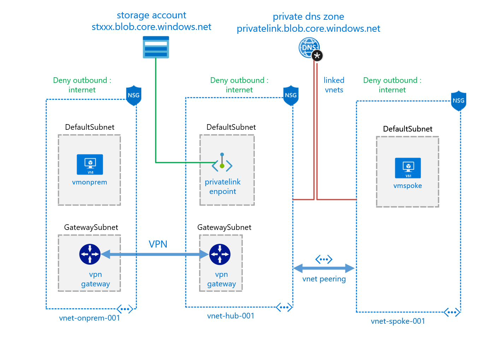
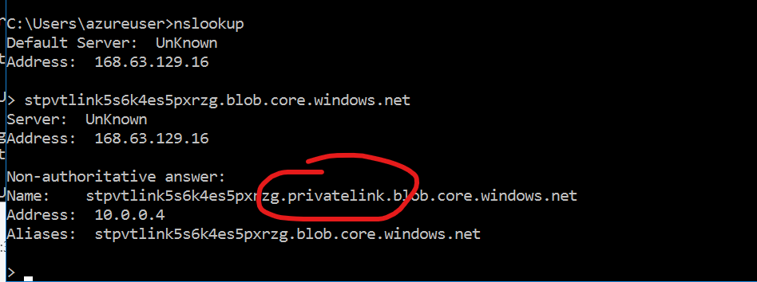
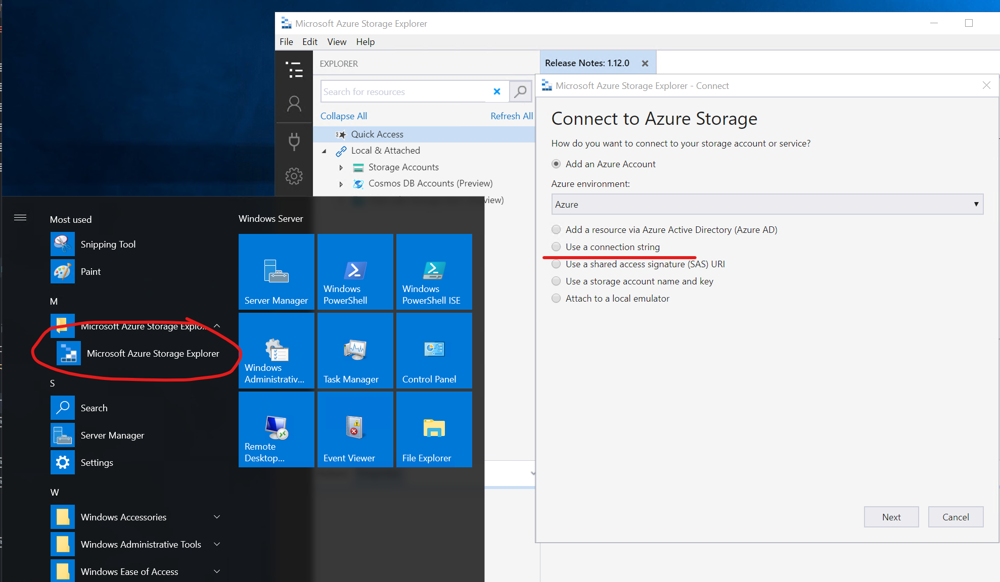
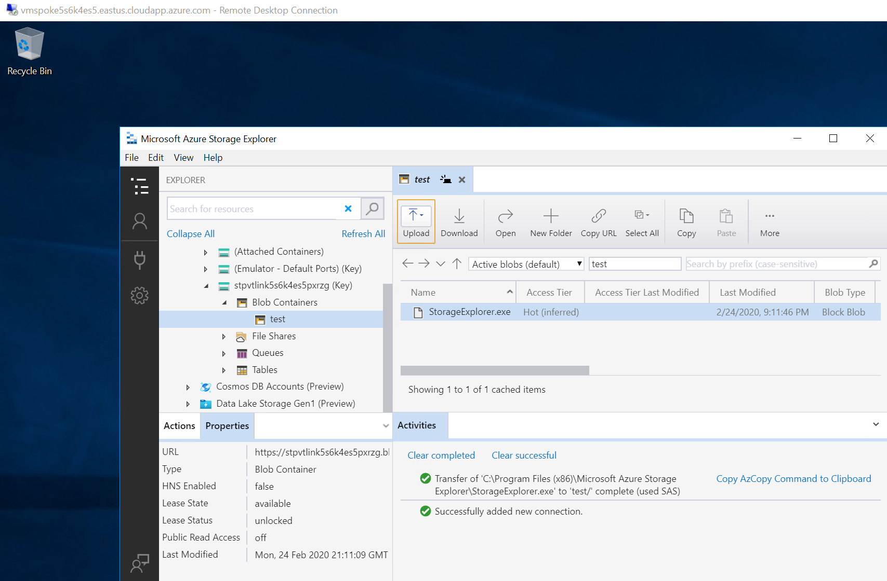

# Azure Private Link Scenarios

This is intended to review different scenarios where azure privatelink could be used 

## Table of Contents

- [General Info](#geninfo)
- [Private Link Endpoint to a blob storage](#privateendpointblob)

# General Info

[Azure's Private Link Service](https://docs.microsoft.com/en-us/azure/private-link/) allows to consume privately PaaS services like (storage accounts,sql database, cosmos db) 

There is two main features:
1. [private link endpoint](https://docs.microsoft.com/en-us/azure/private-link/private-endpoint-overview) : Consume privately a PaaS service through a private IP deployed into a VNet, allowing the consumption of the blob service where that IP address can be reached, like on-prem or peered VNets 


2. [private link service](https://docs.microsoft.com/en-us/azure/private-link/private-link-service-overview) : Expose a service that is running behind Azure Standard Load Balancer can be enabled for Private Link access so that consumers to your service can access it privately from their own VNets. 


# Private Link Endpoint to a blob storage
This scenario is intended to demonstrate private link enpoint in an 
 [spoke an hub architecture](ttps://docs.microsoft.com/en-us/azure/architecture/reference-architectures/hybrid-networking/hub-spoke) allowing the consumption of a blob storage through a privatelink endpoint, enabling the use case where the information must not be accessible from internet and exposed privately to certain clients, also demonstrates the consumption of the blob in a private manner from an on-prem vnet connected via vpn.



this escenario is deployed using arm templates by executing deploy.ps1
### [deploy.ps1](endpointblob/deploy.ps1)
inputs for deploy.ps1:
```yaml
$resourceGroupName : azure rource group name (new or existing) 

$location: azure region where de deployment should run 

$vmUser : Username for the virtual machines

$vmPass : password asigned to virtual machines

$deploygw : (yes/no) parameter to if you want to deploy vpn gateways (15-20 minutes to deploy)
```

output
```yaml
OutputsString           : 
                          Name                   Type                       Value
                          =====================  =========================  ==========
                          storageblobendpoint    String                     stpvtlinkxxxxxx.blob.core.windows.net
                          storageconnstring      String
                          DefaultEndpointsProtocol=https;AccountName=stpvtlinkxxxxx;AccountKey=xxxxxxxxxxxxxxxxxxxxxxxxxxxxxxxxxxxx
                          vmpass                 String                     P1xxxxxxxxxxx
                          vmonpremurl            String                     vmonpremxxxxx.eastus.cloudapp.azure.com
                          vmspokeurl             String                     vmspokexxxxx.eastus.cloudapp.azure.com
```                          

## How to test the scenario
RDP into the spoke virtual machine (vmspokeurl)

1. first notice that the machine doesn’t have internet access, you can ping an external site, or try to navigate to some web page 

2. try to resolve with nslookup the blob storage endpoint url (storageblobendpoint) and see that a Private IP is resolved by the private dns zone deployed, this should resolve to the private ip 10.0.0.4

Notice the alias record that resolves privatelink.blob.core.windows.net 

So in order to make the dns resolution and access to storage account work, you should have on your network a DNS that resolves that record to the private ip. 

That's why in the scenario there is a deployment of private dns zone that help us with that name resolution.




3. open storage explorer that is already installed and use the storageconnstring to connect privately to the storage account



4. you should be able to interact with the storage account in a private manner




# Private Link Service
- [ ] This scenario is intended to demonstrate private link service,
