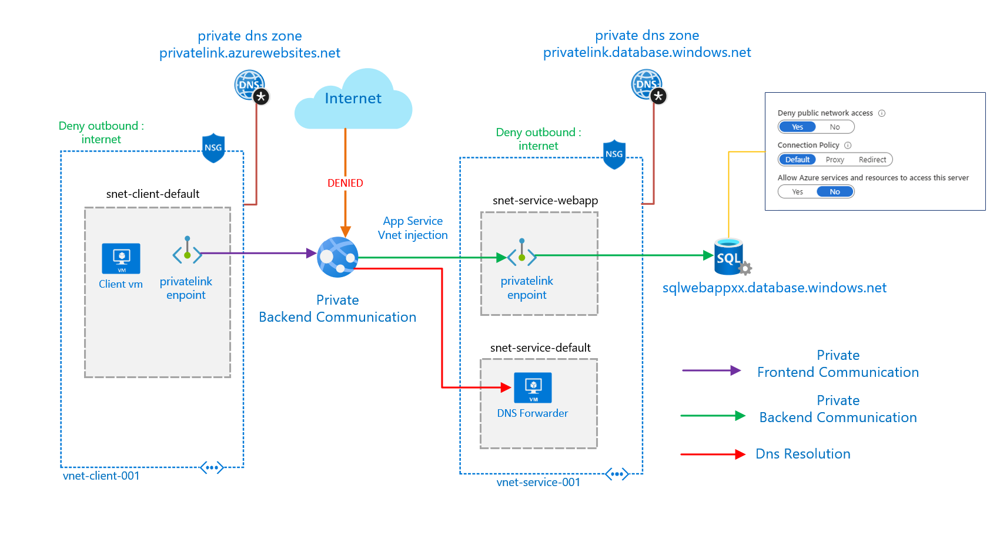

# Azure Private Link Scenarios

This is intended to review different scenarios where azure privatelink could be used 

## Table of Contents

- [General Info](#General-Info)
- [Private Link Endpoint to a blob storage](#Private-Link-Endpoint-to-a-blob-storage)
- [Private Link Service scenario](#Private-Link-Service)
- [Webapp and azure sql scenario](#Web-Application-private-backend)
- [Private web app](#Private-Web-Application-with-privatelink)
# General Info

[Azure's Private Link Service](https://docs.microsoft.com/en-us/azure/private-link/) allows to consume privately PaaS services like (storage accounts,sql database, cosmos db) 

There is two main features:
1. [private link endpoint](https://docs.microsoft.com/en-us/azure/private-link/private-endpoint-overview) : Consume privately a PaaS service through a private IP deployed into a VNet, allowing the consumption of the blob service where that IP address can be reached, like on-prem or peered VNets 

2. [private link service](https://docs.microsoft.com/en-us/azure/private-link/private-link-service-overview) : Expose a service that is running behind Azure Standard Load Balancer can be enabled for Private Link access so that consumers to your service can access it privately from their own VNets. 

# [Private Link Endpoint to a blob storage](endpointblob/README.md)
This scenario is intended to demonstrate private link enpoint in an 
 [spoke an hub architecture](https://docs.microsoft.com/en-us/azure/architecture/reference-architectures/hybrid-networking/hub-spoke) allowing the consumption of a blob storage through a privatelink endpoint, enabling the use case where the information must not be accessible from internet and exposed privately to certain clients, also demonstrates the consumption of the blob in a private manner from an on-prem vnet connected via vpn.

# [Private Link Service](privatelinkservice/README.md)

This scenario is intended to demonstrate a connection between a privatelink service (provider) and a privatelink endpoint (consumer) where the provider wants to expose privately a service behind a standard load balancer and can be consumed by multiple clients using a private ip on the client address space.

 

# [Web Application private backend](webapp/README.md) 

This scenario shows a web app that comunicates privately to an azure sql database using a privatelink endpoint.
The Frontend of the webapp is public

 

# [Private Web Application with privatelink](privatewebapp/README.md)

This scenario shows a web app that comunicates privately to an azure sql database and has a private frontend.
Consumed by a client in a private manner via appservice private link.

 

