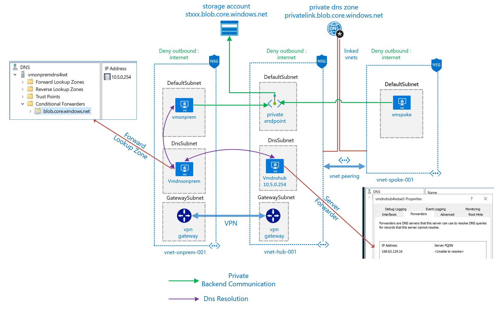
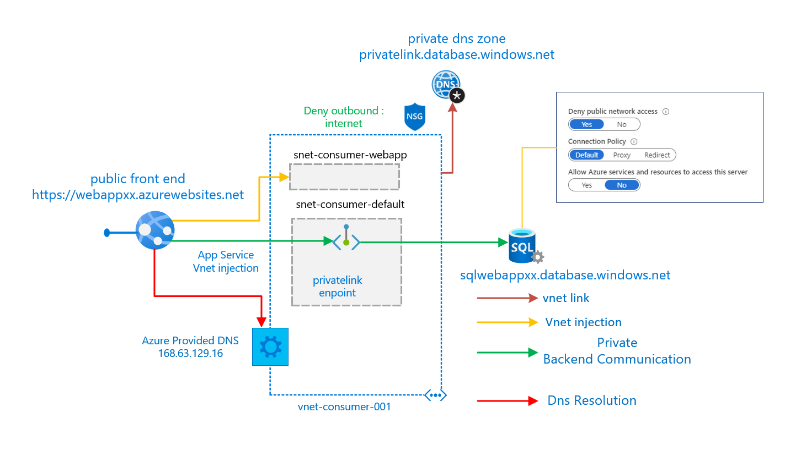

# Azure Private Link Scenarios

This is intended to review different scenarios where azure private link could be used

## General Info

[Azure's Private Link Service](https://docs.microsoft.com/azure/private-link/) allows to consume privately PaaS services like (storage accounts,sql database, cosmos db).

There is two main features:

1. [private endpoint](https://docs.microsoft.com/azure/private-link/private-endpoint-overview) : Consume privately a PaaS service through a private IP deployed into a VNet, allowing the consumption of the blob service where that IP address can be reached, like on-prem or peered VNets.

2. [private link service](https://docs.microsoft.com/azure/private-link/private-link-service-overview) : Expose a service that is running behind Azure Standard Load Balancer can be enabled for Private Link access so that consumers to your service can access it privately from their own VNets.

## [Private Endpoint to a blob storage](endpointblob/README.md)

This scenario is intended to demonstrate private endpoint in an
 [spoke an hub architecture](https://docs.microsoft.com/azure/architecture/reference-architectures/hybrid-networking/hub-spoke) allowing the consumption of a blob storage through a private endpoint, enabling the use case where the information must not be accessible from internet and exposed privately to certain clients, also demonstrates the consumption of the blob in a private manner from an on-prem VNet connected via vpn.

## [Private Link Service](privatelinkservice/README.md)

This scenario is intended to demonstrate a connection between a private link service (provider) and a private endpoint (consumer) where the provider wants to expose privately a service behind a standard load balancer and can be consumed by multiple clients using a private ip on the client address space.

## [Windows web app with private backend](webappazuredns/README.md)

This scenario shows a windows web app that communicates privately to an azure sql database using a private link endpoint.
The Frontend of the webapp is public

## [Private Web Application with private endpoint](privatewebapp/README.md)

This scenario shows a web app that communicates privately to an azure sql database and has a private frontend.
Consumed by a client in a private manner via app service private link.

## [Windows web app with Cosmos DB private backend](privatelinkcosmosdb/README.md)

This scenario shows a windows web app that communicates privately to Cosmos DB using a private endpoint.
The Frontend of the webapp is public

