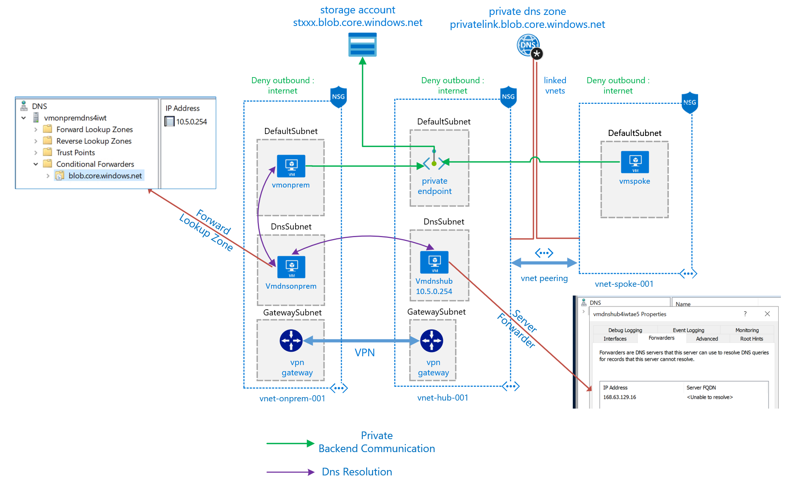
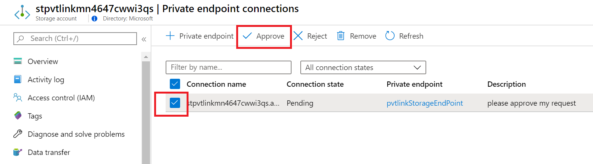
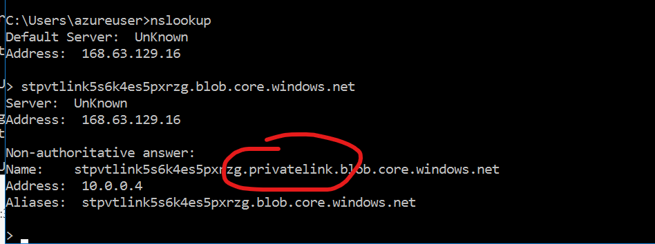
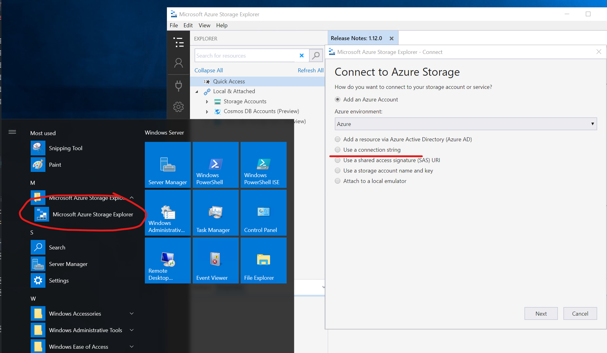
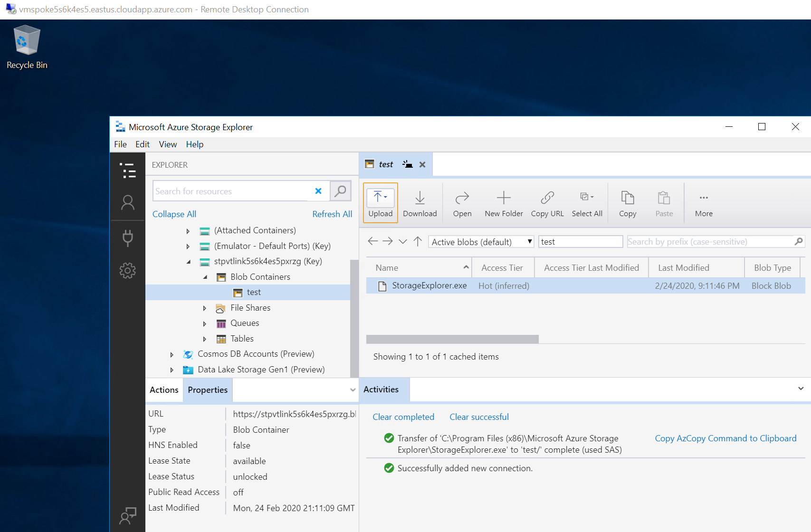

# Private Link Endpoint to a blob storage

This scenario is intended to demonstrate private link endpoint in an
 [spoke an hub architecture](ttps://docs.microsoft.com/azure/architecture/reference-architectures/hybrid-networking/hub-spoke) allowing the consumption of a blob storage through a private link endpoint, enabling the use case where the information must not be accessible from internet and exposed privately to certain clients, also demonstrates the consumption of the blob in a private manner from an on-prem VNet connected via vpn.

[](https://portal.azure.com/#create/Microsoft.Template/uri/https%3A%2F%2Fraw.githubusercontent.com%2Fmblanco77%2Fprivatelink%2Fmaster%2Fendpointblob%2Fazuredeploy.json)



this scenario is deployed using arm templates by executing deploy.ps1
### [deploy.ps1](deploy.ps1)
inputs for deploy.ps1:
```yaml
$resourceGroupName : azure resource group name (new or existing)

$location: azure region where de deployment should run

$vmUser : Username for the virtual machines

$vmPass : password assigned to virtual machines

$deployVpnGateways : (yes/no) parameter to if you want to deploy vpn gateways (15-20 minutes to deploy)

$autoApprove : "private link auto Approval workflow (yes/no)"
```

output

```yaml
OutputsString           :
                          Name                   Type                       Value
                          =====================  =========================  ==========
                          storageblobendpoint    String                     stpvtlinkxxxxxx.blob.core.windows.net
                          storageconnstring      String
                          DefaultEndpointsProtocol=https;AccountName=stpvtlinkxxxxx;AccountKey=xxxxxxxxxxxxxxxxxxxxxxxxxxxxxxxxxxxx
                          vmpass                 String                     P1xxxxxxxxxxx
                          vmonpremurl            String                     vmonpremxxxxx.eastus.cloudapp.azure.com
                          vmspokeurl             String                     vmspokexxxxx.eastus.cloudapp.azure.com
```

## How to test the scenario

- If you selected  **"NO"** at the autoApprove parameter , you must first approve the private endpoint




- RDP into the spoke or on-premises virtual machine (vmspokeurl/vmonpremurl)

1. first notice that the machine doesn’t have internet access, you can ping an external site, or try to navigate to some web page.

2. try to resolve with nslookup the blob storage endpoint url (storageblobendpoint) and see that a Private IP is resolved by the private dns zone deployed, this should resolve to the private ip 10.0.0.4

Notice the alias record that resolves privatelink.blob.core.windows.net

So in order to make the dns resolution and access to storage account work, you should have on your network a DNS that resolves that record to the private ip.

That's why in the scenario there is a deployment of private dns zone that help us with that name resolution.



3. Open storage explorer that is already installed and use the storageconnstring to connect privately to the storage account.



4. You should be able to interact with the storage account in a private manner

