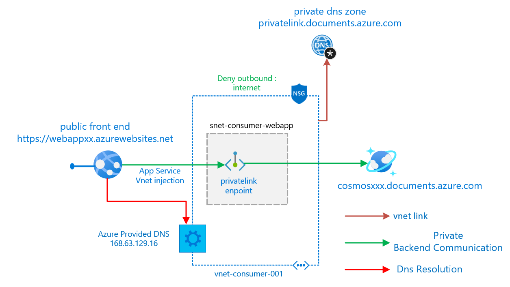
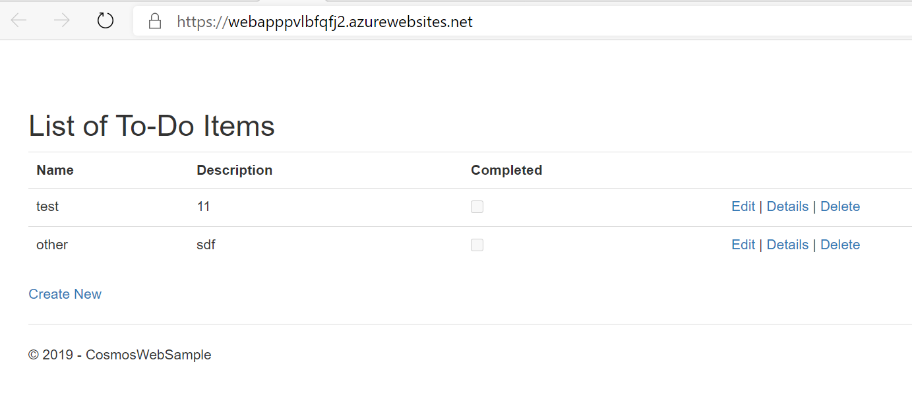
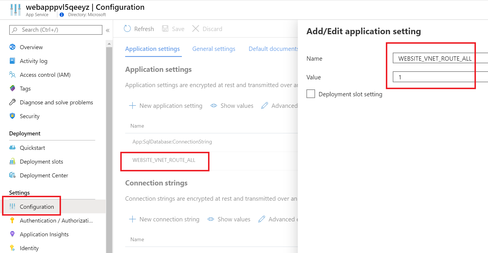
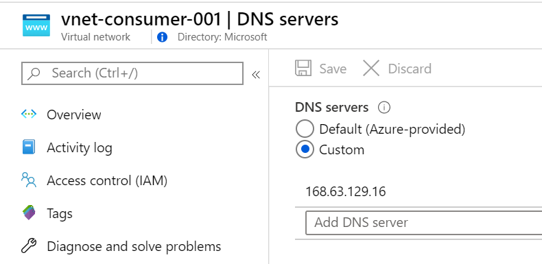
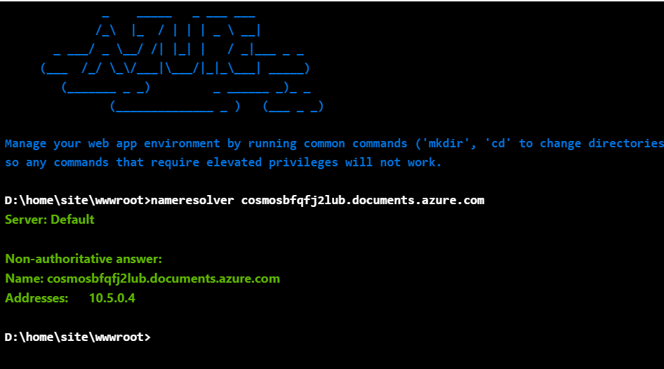
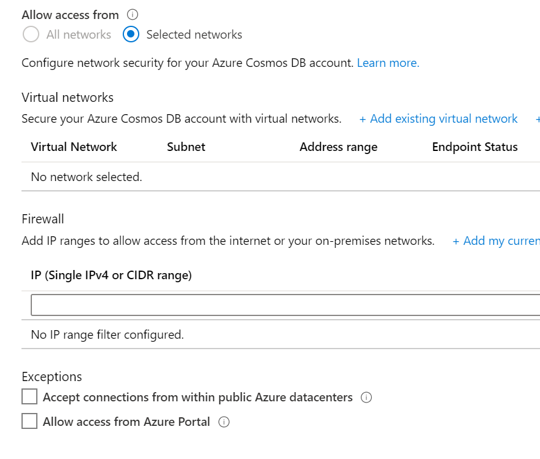

# Windows web app with Cosmos DB private backend

This scenario shows a windows web app that communicates privately to Cosmos DB using a private link endpoint.
The Frontend of the webapp is public

[](https://portal.azure.com/#create/Microsoft.Template/uri/https%3A%2F%2Fraw.githubusercontent.com%2Fmblanco77%2Fprivatelink%2Fmaster%2Fprivatelinkcosmosdb%2Fazuredeploy.json)



this scenario is deployed using arm templates by executing deploy.ps1
### [deploy.ps1](deploy.ps1)
inputs for deploy.ps1:
```yaml
$resourceGroupName : azure resource group name (new or existing)
$location: azure region where de deployment should run
$autoApprove: Use manual or auto approve workflow of private link
```

output:
```yaml
OutputsString           :
                          Name             Type                       Value
                          ===============  =========================  ==========
                          webappurl        String                     webappxxx.azurewebsites.net
```

## How to test the scenario


1. Browse into the sample web app (webappurl) https://webapppxxxxx.azurewebsites.net , you should see the todo sample app 



2. Follow the Create New link , to create a record in the CosmosDB

This shows that theres is actual communication with the Cosmos DB


## DNS Resolution

In order to let the app service use the Azure provided DNS, you must configure an app setting WEBSITE_VNET_ROUTE_ALL with value 1, for more info [regional Vnet Integration](https://docs.microsoft.com/en-us/azure/app-service/web-sites-integrate-with-vnet#regional-vnet-integration), additionally you have to configure the custom vnet DNS to [168.63.129.16](https://docs.microsoft.com/en-us/azure/virtual-network/what-is-ip-address-168-63-129-16).

### DNS forwarding configuration

Web App app setting



Custom DNS vnet



### Test DNS resolution in the web app

You can use the console in the app service to call nameresolver to check if the dns resolution is working as expected



## CosmosDB Firewall configuration

To make completely private the communication between de web app and the Cosmos DB

Deny public network access
Deny Access from Azure Services



# Notes:

* The feature is available only from newer Azure App Service scale units that support PremiumV2 App Service plans.

* The feature is in preview for Linux. The Linux form of the feature only supports making calls to RFC 1918 addresses (10.0.0.0/8, 172.16.0.0/12, 192.168.0.0/16).
