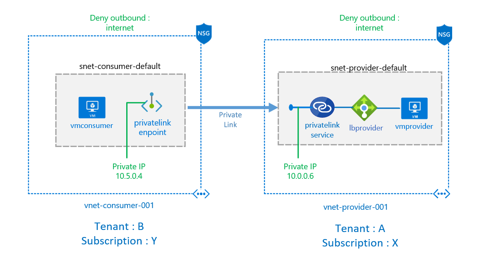

# Private link service scenario

This scenario is intended to demonstrate a connection between a private link service (provider) and a private link endpoint (consumer) where the provider wants to expose privately a service behind a standard load balancer and can be consumed by multiple clients using a private ip on the client address space.

[](https://portal.azure.com/#create/Microsoft.Template/uri/https%3A%2F%2Fraw.githubusercontent.com%2Fmblanco77%2Fprivatelink%2Fmaster%2Fprivatelinkservice%2Fazuredeploy.json)



this scenario is deployed using arm templates by executing deploy.ps1
### [deploy.ps1](deploy.ps1)
inputs for deploy.ps1:

```yaml
$resourceGroupName : azure resource group name (new or existing)
$location: azure region where de deployment should run
$vmUser : Username for the virtual machines
$vmPass : password assigned to virtual machines
```

output:

```yaml
OutputsString           :
                          Name             Type                       Value
                          ===============  =========================  ==========
                          vmuser           String                     azureuser 
                          vmpass           String                     P1xxxxxxxx
                          vmconsumerurl    String                     vmconsumerxxx.eastus.cloudapp.azure.com
```

## How to test the scenario

RDP into the consumer virtual machine (vmconsumerurl)

1. first notice that the machine doesn’t have internet access, you can ping an external site, or try to navigate to some web page

2. consume via browser the service exposed in http://10.5.0.4 which is mapped to private ip of the standard load balancer of the provider.


## Notes:

*This can be enabled in different tenant and subscriptions

*This Enables also an scenario where the provider and the consumer have overlapping addresses where private peering cannot be used

