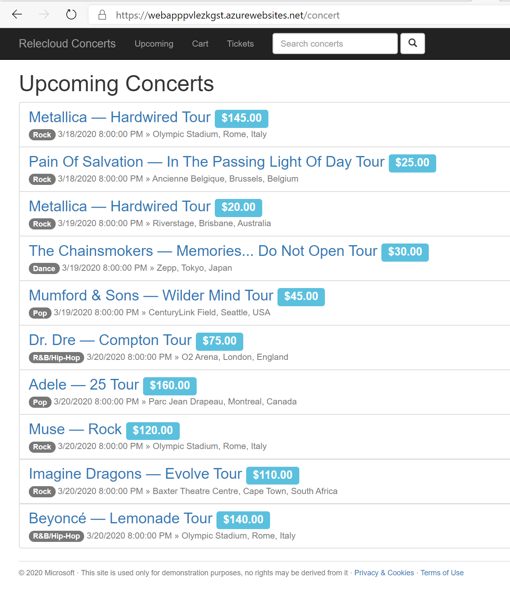

# Web Application privatelink 

This scenario shows a web app that comunicates privately to an azure sql database and has a private frontend.
Consumed by a client in a private manner via appservice private link.

[](https://portal.azure.com/#create/Microsoft.Template/uri/https%3A%2F%2Fraw.githubusercontent.com%2Fmblanco77%2Fprivatelink%2Fmaster%2Fprivatewebapp%2Fazuredeploy.json)

 


this escenario is deployed using arm templates by executing deploy.ps1
### [deploy.ps1](deploy.ps1)
inputs for deploy.ps1:
```yaml
$resourceGroupName : azure rource group name (new or existing) 

$location: azure region where de deployment should run 

$vmUser : Username for the virtual machines

$vmPass : password asigned to virtual machines

```

output:
```yaml
OutputsString           :
                          Name             Type                       Value
                          ===============  =========================  ==========
                          vmuser           String                     azureuser
                          vmpass           String                     P1xxxxxxxxxx
                          vmClienturl      String                     vmconsumerxxxx.eastus.cloudapp.azure.com
                          webappurl        String                     webapppxxxxx.azurewebsites.net
```                          

## How to test the scenario


1. Browse into the sample web app (webappurl) https://webapppxxxxx.azurewebsites.net , you should see the an access denied error.
Because when the private link endpoint is created , Public access to the web app is denied.


2. RDP into the client vm (vmClienturl) , and via powershell make a Test-Connection to the (webappurl) https://webapppxxxxx.azurewebsites.net , this should return the private endpoint address (10.10.0.4)


3. Browse into the sample web app (webappurl) https://webapppxxxxx.azurewebsites.net , you should see the concerts home page


4. Follow the Upcoming link, the application goes to the Database to fetch the records, this communication betweeen the web application and the database occurs in a private manner via the azure sql private link endpoint.

This test that theres is actual comunication with the azure sql database




