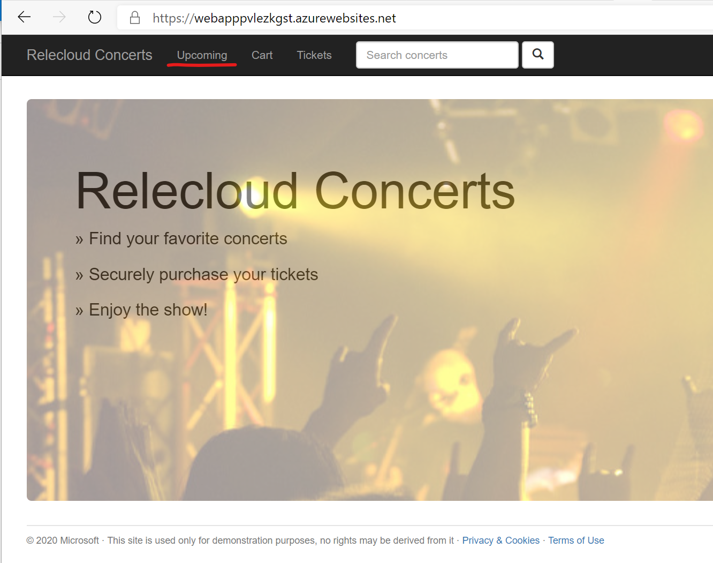
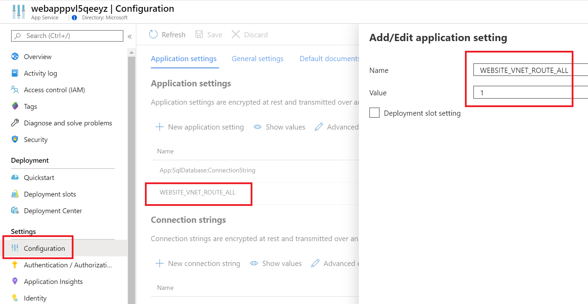
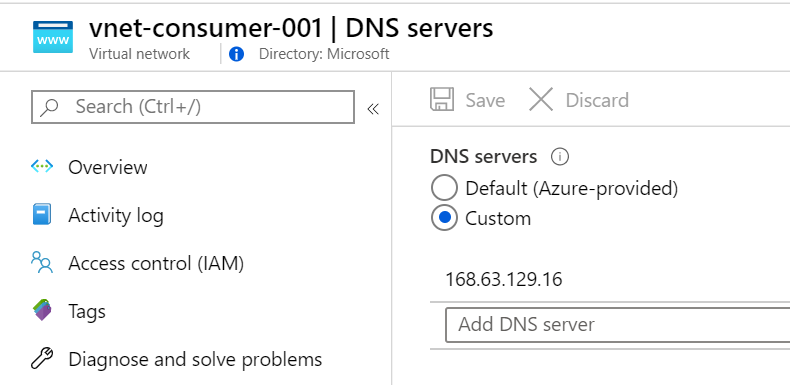
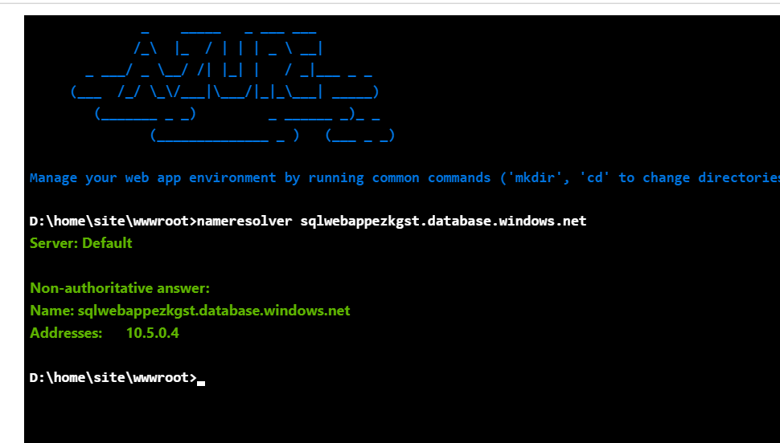

# Windows web app with private backend

This scenario shows a windows web app that communicates privately to an azure sql database using a private link endpoint.
The Frontend of the webapp is public

[](https://portal.azure.com/#create/Microsoft.Template/uri/https%3A%2F%2Fraw.githubusercontent.com%2Fmblanco77%2Fprivatelink%2Fmaster%2Fwebappazuredns%2Fazuredeploy.json)


this scenario is deployed using arm templates by executing deploy.ps1
### [deploy.ps1](deploy.ps1)
inputs for deploy.ps1:
```yaml
$resourceGroupName : azure resource group name (new or existing)
$location: azure region where de deployment should run
$username : Username for the Azure SQL DB
$pass : password assigned to the Azure SQL DB
```

output:
```yaml
OutputsString           :
                          Name             Type                       Value
                          ===============  =========================  ==========
                          webappurl        String                     webappxxx.azurewebsites.net
```

## How to test the scenario


1. Browse into the sample web app (webappurl) https://webapppxxxxx.azurewebsites.net , you should see the concerts home page



2. Follow the Upcoming link, the application goes to the Database to fetch the records, this communication between the web application and the database occurs in a private manner via the azure sql private link endpoint.

This shows that theres is actual communication with the azure sql database


## DNS Resolution

In order to let the app service use the Azure provided DNS, you must configure an app setting WEBSITE_VNET_ROUTE_ALL with value 1, for more info [regional Vnet Integration](https://docs.microsoft.com/en-us/azure/app-service/web-sites-integrate-with-vnet#regional-vnet-integration), additionally you have to configure the custom vnet DNS to [168.63.129.16](https://docs.microsoft.com/en-us/azure/virtual-network/what-is-ip-address-168-63-129-16).

### DNS forwarding configuration

Web App app setting



Custom DNS vnet



### Test DNS resolution in the web app

You can use the console in the app service to call nameresolver to check if the dns resolution is working as expected



## Azure SQL Firewall configuration

To make completely private the communication between de web app and the database

Deny public network access
Deny Access from Azure Services


# Notes:

* The feature is available only from newer Azure App Service scale units that support PremiumV2 App Service plans.

* The feature is in preview for Linux. The Linux form of the feature only supports making calls to RFC 1918 addresses (10.0.0.0/8, 172.16.0.0/12, 192.168.0.0/16).
