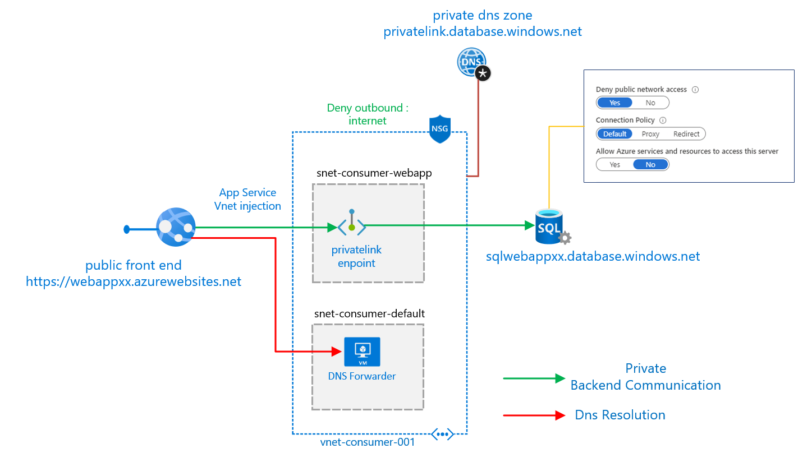
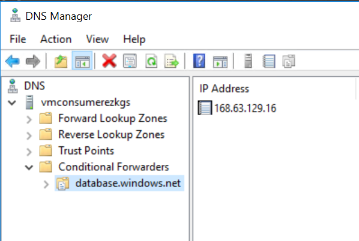
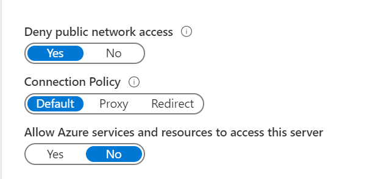

# Web Application private backend 

This scenario shows a web app that comunicates privately to an azure sql database using a privatelink endpoint.
The Frontend of the webapp is public

[](https://portal.azure.com/#create/Microsoft.Template/uri/https%3A%2F%2Fraw.githubusercontent.com%2Fmblanco77%2Fprivatelink%2Fmaster%2Fwebapp%2Fazuredeploy.json)

 


this scenario is deployed using arm templates by executing deploy.ps1
### [deploy.ps1](deploy.ps1)
inputs for deploy.ps1:
```yaml
$resourceGroupName : azure resource group name (new or existing) 

$location: azure region where de deployment should run 

$UserName: : Username used for the Azure SQL admin

$pass : password assigned to the Azure SQL

```

output:
```yaml
OutputsString           :
                          Name             Type                       Value
                          ===============  =========================  ==========
                          vmuser           String                     azureuser
                          vmpass           String                     P1xxxxxxxxxx
                          vmconsumerurl    String                     vmconsumerxxxx.eastus.cloudapp.azure.com
                          webappurl        String                     webapppxxxxx.azurewebsites.net
```                          

## How to test the scenario


1. Browse into the sample web app (webappurl) https://webapppxxxxx.azurewebsites.net , you should see the concerts home page


2. Follow the Upcoming link, the application goes to the Database to fetch the records, this communication between the web application and the database occurs in a private manner via the azure sql private link endpoint.

This test that theres is actual communication with the azure sql database


## DNS Resolution

Because of the lack of integration between azure private zone and app service, the name resolution must be done by a Virtual Machine with the DNS forwarding role

### DNS forwarding configuration

A conditional forwarding zone for database.windows.net should be configured to point to [168.63.129.16](https://docs.microsoft.com/en-us/azure/virtual-network/what-is-ip-address-168-63-129-16)
which is the ip that the azure platform designates to communicate with the DNS virtual server, in this case the Azure Private Zone DNS.



### Test DNS resolution in the web app

You can use the console in the app service to call nameresolver to check if the dns resolution is working as expected


## Azure SQL Firewall configuration

To make completely private the communication between de web app and the database

Deny public network access
Deny Access from Azure Services



# Notes:

* There is no integration of private dns zones to app service, thats why is necesary the virtual machine with the dns forwarder role and configure this DNS in the vnet that is going to be injected.


